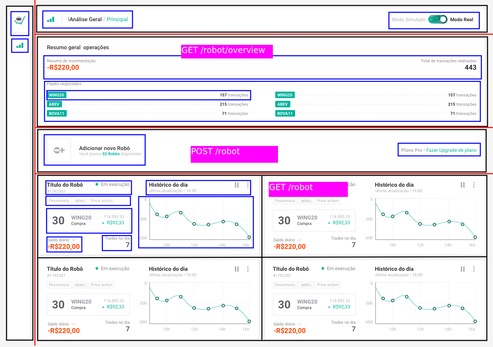

# Getting Started

### `yarn start`

Executa a aplicação em modo de desenvolvimento.
Abra [http://localhost:3000](http://localhost:3000) para ver no navegador.

### `yarn test`

Executa os testes.

# O projeto

Como o projeto ficou extenso, irei dividir as explicações em sessões, nas quais explicarei o objetivo do componente, as dificuldades encontradas e o que, na minha visão, eu poderia ter feito melhor.

## Sumário

- [Sobre](#sobre)
  - [Tecnologias](#tecnologias)
  - [Algumas Considerações](#algumas-considerações)
  - [Git](#git)
- [Containers](#containers)
  - [Header](#header)
  - [Sidear](#sidebar)
  - [RobotOverview](#robotoverview)
  - [RobotList](#robotlist)
  - [AddNewRobot](#addnewrobot)
  - [NewRobotForm](#newrobotform)
- [Components](#components)
  - [Robot](#robot)
- [Outros](#outros)
  - [Hooks](#hooks)
  - [Store](#store)

## Sobre o projeto

### Tecnologias

O projeto foi desenvolvido utilizando:

- React JS
- Typescript
- Styled Componentes
- Redux
- Redux-thunk
- Axios
- Formik
- React-router-dom
- Material UI
- Rechart

### Algumas considerações

O projeto foi bem legal, me deu a oportunidade de entrar em contato com algumas coisas novas que com certeza irei absorver para os meus próximos projetos. Através do meu código tentei mostrar que tenho um entendimento sobre css, o jeito React de pensar e sobre a integração de bibliotecas de terceiros.

Optei por usar o Typescript pois o intellisense "enxerga" bugs antes de entrarem em produção. Além disso,
ele permite que o código escrito seja mais fácil de entender, de escalar e nos torna mais produtivos.

Apesar de já ter feito alguns programinhas usando sagas, aprender redux-thunk foi um pequeno obstáculo. Apesar das minhas requisições assíncronas estarem funcionando, eu não consegui testá-las. A tipagem do thunk e o mock do state nos testes foram difíceis, e faltou alguma coisa para que eu conseguisse entender 100%. Com isso não consegui testar os componentes que disparavam actions ou pegavam informações do state.

O Material UI foi outro problema. Eu comecei o projeto usando Styled-components. A decisão de integrar o Material UI - biblioteca que até então eu nunca tinha mexido - veio bem ao final. Ele tem uma curva de aprendizado própria e não tive o tempo hábil para integrá-lo com um resultado satisfatório.

### Git

Para controle de versão optei por utilizar um branch master para o código testado e em produção, um branch develop para features em teste e branches individuais para desenvolver cada feature.

O resultado final do layout da aplicação:

  

## Containers

Meu primeiro passo foi definir uma estrutura separando os componentes em:

- Template da página, linhas em vermelho.
- Containers, linhas pretas, que representariam os organismos em um contexto de atomic design.
- Em azul as moléculas, representando elementos de interface que funcionam juntos.
- Em rosa a relação entre os componentes e os endpoints da API.

  

Com base nisso irei explicar os containers, definido pelas linhas pretas e algumas melhorias que eu deveria ter implementado mas pela falta de tempo não o fiz.

### Header

  

Path: src/containers/Header

Eu pensei no header como um componente que recebe do pai um título, um subtítulo, um ícone à esquerda e um componente à direita.

**Melhorias**: Usar o padrão render props para injetar o componente da direita, e deixar a regra de negócio associada à ele no elemento pai.

### Sidebar

  

Path: src/containers/Sidebar

A sidebar é um componente que renderiza sidebarItem's, que são links que levam a outras rotas da aplicação. No modo responsivo a sidebar apresenta um backdrop que quando clicado fecha a sidebar. A abertura e fechamento é controlada através de uma variável de estado no Redux.

**Melhorias**: Caso seja necessário utilizar o render props para renderizar uma lista de links (sidebarItems) de navegação.

### RobotOverview

  

Path: src/containers/RobotOverview

O RobotOverview é um componente que dispara uma ação para buscar o resumo geral de operações do robô.

**Melhorias**: Em telas menores esconder os papéis negociados e torná-los visíveis através de um botão "Mostrar mais".

### RobotList

  

Path: src/containers/RobotList

O RobotList é um grid que dispara uma action para buscar a lista de instâncias dos robôs todas as vezes que o modo(real-simulado) da aplicação muda ou toda vez que o usuário scrolla até o fim da página.

**Mehorias**: Na versão mobile o scroll infinito não está funcionando.

### AddNewRobot

  

Path: src/containers/AddNewRobot

Container para ações de navegar para um novo plano e abrir uma modal para criar um novo robô.

**Melhorias**: Pegar no store o número real de robôs que o usuário tem disponível.

### NewRobotForm

  

Path: src/containers/NewRobotForm

New robot form é um fomrulário que abre dentro de uma modal e permite o usuário criar um novo robô. Os elementos não estão em suas posições finais e nem com seus estilos finais. Isso se deve ao fato de que, para fazê-lo, eu usei pela primeira vez o Material UI e ainda não absorvi a biblioteca completamente. O que tornou a tarefa bem difícil. Ele usa o formik para fazer o gerenciamento do estado e, junto com o yup, a validação das informações do formulário. A ação de sucesso no post request não foi implementada e nem tampouco a de falha. O máximo que a aplicação mostra nesse momento é uma div com 'Success' ou 'Error' após o post request de criar um robô.

**Melhorias**: Muitas. Estilo, validação de erro do post e do get da api, limpeza de código, validação do campo de capital inicial, quebra em componentes menores e etc.

## Components

Aqui vou listar os componentes mais importantes:

### Robot

  

Path: src/components/Robot

O robot é um componente que mostra as informações de uma instância de um robô. Ele permite ativar e pausar o funcionamento dele.

**Melhorias**: Indicação para o usuário caso tenha acontecido algum erro no put request para pausar or iniciar a operação de um robô. Mover esse componente para os containers. Seria legal implementar as seguinte funcionalidade caso os endpoints da api estivesse disponível: Histórico de compra e venda de uma ação juntamente com um filtro diário, semanal, mensal, trimestral e anual para ela.

## Outros

### Hooks

Fiz 3 hooks para lidar com as requisições assíncronas que não alteravam os dados do estado global da aplicação. São eles:

- **useFetch**: Que retorna uma variável de loading, a resposta e uma variável de erro.
- **usePost**: Que retorna um método post para fazer request na url fornecida, uma variável de loading, a resposta e uma variável de erro.
- **usePut**: Que retorna um método put para fazer request na url fornecida, uma variável de loading, a resposta e uma variável de erro.

E fiz um hook, **useWindowWidth**, para adicionar um evento de resize da tela e expor este valor para o componente que o implementa.

### Store

O store da aplicação é dividido em três módulos. Um módulo de UI que armazena o estado da sidebar (Aberta ou fechada) e o estado do botão que troca o modo da aplicação (Simulado ou real). O módulo RobotList armazena a lista de instâncias de robôs e o modo robotOverview armazena o resumo geral de operações do robô.
